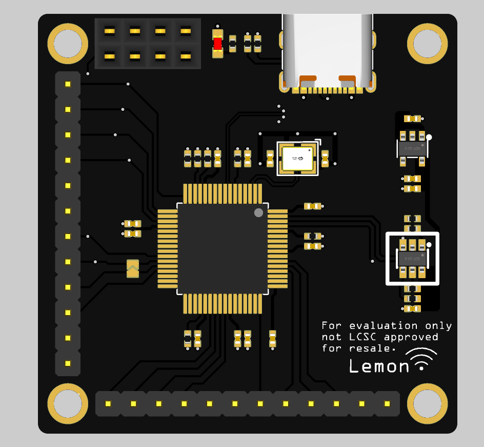

# TPS6598x_PDControl：基于TPS6598x

> *（ti是直接在键盘上取得一排字母吧）*

ti 针对`USBC接口`应用设计两款PD控制器、其中根据型号分为`USB3`、 `Thunderbolt 3` 、`USB4`三款：

- DH：`USB3`

- DJ：`Thunderbolt 3` 

- DK：`USB4`

  这里设计讨论的是DH型号，DJ、DK型号在USB协会和Intel有参考设计及固定用法，无法定制。

## Disign Target

**TPS65988**系列具有两通道CC Phy，**TPS65987**系列具有一通道CC Phy，设计期望为：

1. **TPS65988**系列可以产生双通道CC的沟通功能，包括但不限于同时使用`DP AltMode`。
2. **TPS65988**系列仅1 C产生`DP AltMode`，另1 C为适配器电源输入
3. **TPS65987**系列仅产生`DP AltMode`

由于设计上的趋同性，目标为设计一块PCB，同时兼容**TPS65987**及**TPS65988**。

## Project Load

| Log                                                          |
| :----------------------------------------------------------- |
| 2024/02/10 仔细阅读Ti官方参考设计，查阅资料 初步理清各模块之间关系 |
| 2024/03/01 设计TPS下载底板，引出对应引脚，以供后续使用    |
| 2024/03/28 由于咕咕决心非常大，说好3月底能画出来……        |
| 2024/04/18 感觉需要多试试，不能再咕咕了（）大不了先不用DP Alt。。 |
| 2024/04/21 画了个FT4232底板拓展出多功能协议转换器+串口，但是如何配置EEP成SPI+IIC模式是个难题（  |

## 参考

- [TPS65987DDH Datasheet](https://www.ti.com/cn/lit/ds/symlink/tps65987d.pdf)

- [TPS65988DDH Datasheet](https://www.ti.com/cn/lit/ds/symlink/tps65988.pdf)
